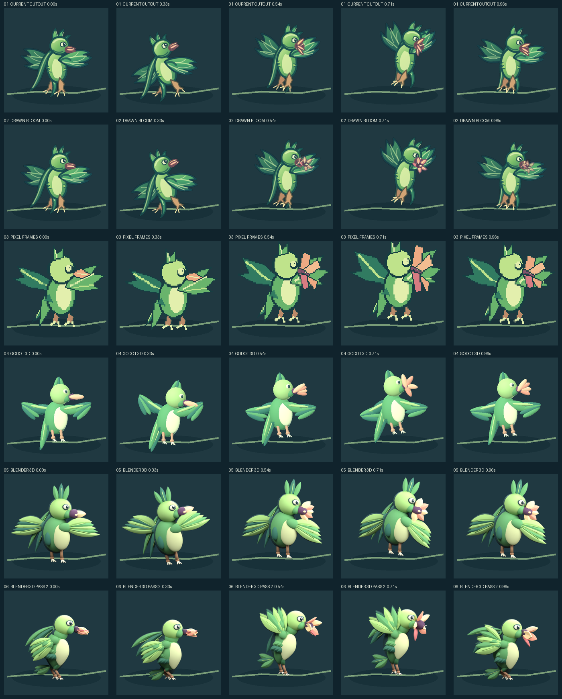
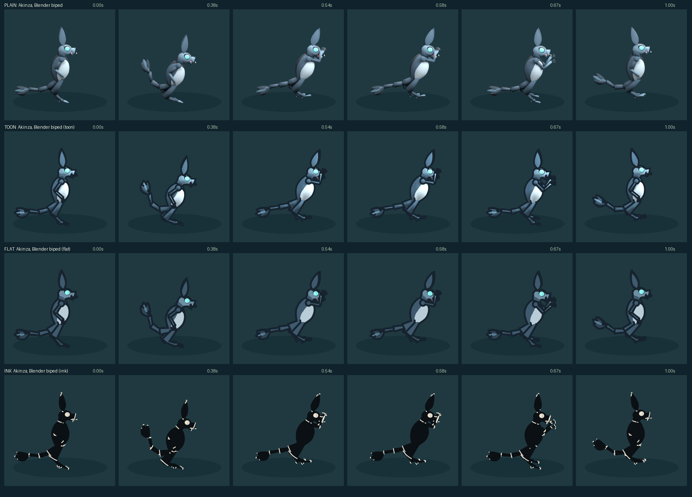
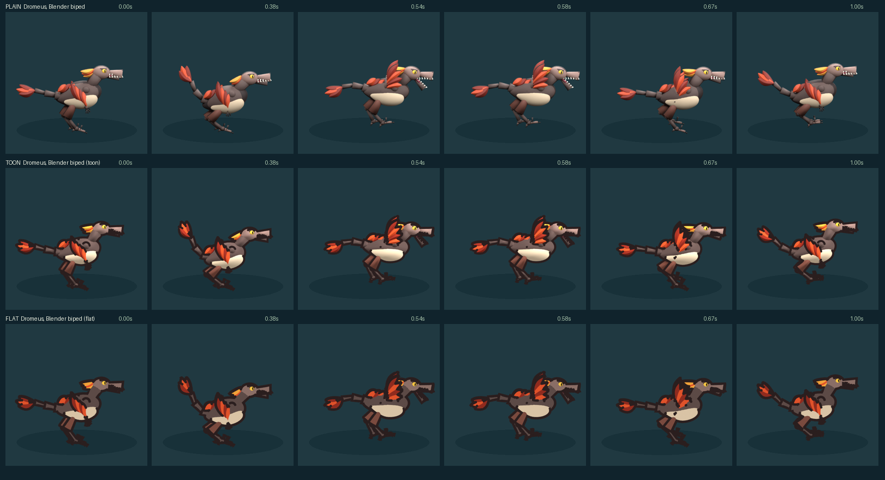
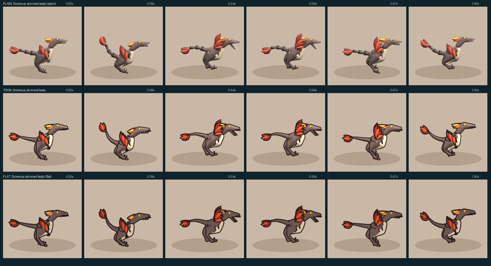

# Avilily motion comparison and the species rig library

This is a local animation study of one lore-grounded action in six motion trials, plus three further species built through a shared, spec-driven rig library. It does not select the permanent Xalians art style or change a game. The ratified species templates and the existing portraits remain the character references.

Open [the interactive comparison](http://127.0.0.1:8766/creature-motion-comparison/) after running `./start-comparison.ps1`. Play the action at 1× with the secretion cue off, then pause, scrub, turn the cue on, and switch the stage background. Two companion pages sit beside it: [pass2.html](http://127.0.0.1:8766/creature-motion-comparison/pass2.html) plays the first and second Blender passes on two 390 px stages with frame strips, and [study.html](http://127.0.0.1:8766/creature-motion-comparison/study.html?study=dromeus-blender) plays any single spec-built study (`?study=blender2`, `bioflim-blender`, `dromeus-blender`, or `akinza-blender`) with its provenance line; the Akinza page also plays the pilot's hand-keyed cutout beside it.



| Trial | Editable source | Actual method |
| --- | --- | --- |
| 01 Current cutout | `../creature-motion-pilot/source/avilily.svg` and its Godot scene | Existing hand-keyed 2D rig frames, used as the control |
| 02 Cutout with drawn bloom | `source/hybrid-bloom.svg`, the same Godot rig, and `../creature-motion-pilot/godot/render_hybrid_base.gd` | The rig is rendered without its cutout petals, then a replacement flower drawing is composited through the action |
| 03 Pixel frames | `build.py` plus the 96 px PNG cels in `source/pixel/` | Poses are drawn on a fixed pixel grid and shown with nearest-neighbor scaling |
| 04 Godot 3D blockout | `godot3d/avilily_blockout.tscn` and `godot3d/render.gd` | Basic 3D volumes are posed and rendered into the same 2D atlas contract |
| 05 Blender 3D, pass 1 | `blender/avilily_motion.blend` and `blender/build_avilily.py` | Modeled feather groups and hinged petals on keyed object pivots, Cycles to transparent PNG. Kept unchanged as the before |
| 06 Blender 3D, pass 2 | `blender/species/avilily.json` through the `avian` template | Egg body with shape keys, shoulder-hinged wings that sweep back and up, a radial five-petal beak, legs solved against the perch, a baked pose track with lag and overshoot |
| 07 Bioflim | `blender/species/bioflim.json` through the `amorphous` template | A keyed metaball mass (no rig), rock plates riding the hood, a hooded eye, a metaball pseudopod; cue `reach_peak` |
| 08 Dromeus | `blender/species/dromeus.json` through the `biped` template | Horizontal torso, toothed jaws, plumed arm wings, lagging tail, legs solved against stepping ground contacts; the Ashfall Stoop lunge and bite; cue `bite` |
| 09 Akinza | `blender/species/akinza.json` through the same `biped` template | Upright torso, rabbit ears, large eyes, bare clawed arms, plumed tail; Silence of the Long Night, a low dash and claw strike; cue `contact_pose`. The single-study page plays it beside the pilot's hand-keyed cutout of the same species |

All trials export an `idle` loop and `action` clip in the game-neutral `xalians-frame-atlas-v1` format, and every page uses the existing generic atlas reader. A marker such as `bloom_open`, `reach_peak`, or `bite` is a visual cue, not a hit or gameplay result.

## The rig library: species as data

Trials 06 to 09 are not scripts. Each is a JSON spec in `blender/species/` run through `blender/build_species.py` and the `blender/xalians_rig/` package:

| Layer | What it holds | Where |
| --- | --- | --- |
| Species spec | palette, proportions, anatomy switches, clip ranges, timeline markers with the cue flagged, projected points (emitter and contacts), and the performance as a key track `[frame, ease, {param: value}]` | `blender/species/<name>.json` |
| Body-plan template | part construction from the spec and one `apply_pose(frame, clip)`; the template family follows the ratified record's `bodyPlan` | `xalians_rig/templates/avian.py`, `amorphous.py`, `biped.py` |
| Shared library | materials from hex, part builders (egg, tube, feather, leaf, rock plate, metaball mass), the eased key track with lag, the two-link leg solver, the fixed stage (camera, lights, render settings), projection, provenance, frame output | `xalians_rig/*.py` |
| Packer | reads every `rendered/<study>/meta.json`, packs sheets, writes manifests carrying the emitter, cue times, points, and provenance | `build.py` |

What makes a build reproducible:

- Every frame is baked from the track; the script owns easing and lag, so Blender's interpolation never smooths anything.
- The Cycles seed is fixed per spec and the animated seed is off. PNG stamp metadata (date, render time, file path) is disabled. Two renders of one spec are pixel-identical in every frame and produce the same meta file (verified 2026-09-20 for Avilily and Bioflim, and 2026-09-21 for Akinza in the plain, toon and flat styles). They are not always byte-identical, because Blender's PNG writer picks scanline filters adaptively; see "Render styles" below. The library reproduced the earlier hand-scripted renders pixel for pixel before those scripts were removed.
- The manifest records the Blender build, the spec file and its hash, a hash of the library sources, the seed, and the sample count. A packed atlas can be traced to the exact inputs that made it.
- Plate shapes and any other randomness draw from a seeded generator named in the spec (`render.shape_seed`).

What stays hand-authored: the template code for each body plan, the numbers in a species spec, and the judgment of whether a pose reads. Adding Dromeus took a new template (the biped family covers eleven ratified species) plus a spec, about 35 minutes of agent time across two inspection rounds.

**The second-biped test (Akinza, 2026-09-20).** The claim was that a second biped should cost a spec alone. It did not, quite: Dromeus is horizontal and Akinza is upright, so the template needed twelve new proportions and switches (torso pitch, neck root and direction, shoulder and hip placement, tail root, droop and lift direction, ear count, spread and tilt, eye scale, a `swipe` parameter and reach for a claw strike, a palm on bare hands, and optional toe claws). Every one defaults to the Dromeus value, and a pixel regression confirmed Dromeus rendered identically after the change (max channel difference 0 across five sampled frames). Akinza itself is then 95 lines of spec and no code. Two inspection rounds and about 30 minutes of agent time produced a recognizable upright eared figure whose crouch, dash, strike, landing, and return read at 1×; its ears merge into one shape from the three-quarter camera, the strike raises the hands to face height rather than raking forward, and the muzzle still reads as a bill. The lesson is the expected one: the first species in a family pays for the template, the second pays for the family's variation, and the third should pay for nothing but its numbers.

## Render styles: the same rig through a different surface language (2026-09-21)

The plain Cycles render is the study baseline, not a look. `blender/xalians_rig/styles.py` adds three render styles that rewrite every palette material after the creature is built and draw Freestyle contour lines on the fixed stage, so a template and a performance track never know which look is being rendered. A style is the `render.style` field of a spec or a command-line override, `--style=toon`, which renders beside the spec's own study as `<export>-<style>` with its own output folder and label and no saved `.blend`.

| Style | Surface | Line | What it is for |
| --- | --- | --- | --- |
| `plain` | Principled BSDF, three area lights | The templates' own outline shells (a slightly larger ink-colored mesh behind each part) | The baseline every earlier observation was made on |
| `toon` | Toon BSDF two-tone step over a flat shadow term (`TOON` in `styles.py`) | Freestyle silhouette, border, crease and material boundary at 2.4 px | A shaded illustration: volume survives, plastic does not |
| `flat` | Exact palette hex as emission, no shading | The same Freestyle set at 2.6 px | The cutout's graphic language from a 3D source |
| `ink` | Black mass, eyes lit | Pale crease and material-boundary incisions only, no outer contour | The portrait homage, kept as evidence that it needs authored incision edges |

Eye parts (object names containing `eye`, `pupil`, `glint`) are collected into an `unlined parts` collection that the line set excludes, because a contour at this weight swallowed the pupil, and the eye is the contact point. Outline shells are hidden in every lined style.

[styles.html](http://127.0.0.1:8766/creature-motion-comparison/styles.html?species=akinza) plays every rendered style of one species in lockstep on 390 px stages with a beat board below (`?species=akinza|avilily|dromeus|bioflim`). `preview/style-board-<species>.png` is the same board as a still, written by `build.py` from the packed exports:





**Observed on the boards (2026-09-21, inspection at 384 px, not viewer research).** Toon and flat both move the four studies out of the plastic-toy register and into an illustrated one without touching a spec or a template; on Dromeus and Avilily the toon row reads as a finished game sprite at phone size where the plain row reads as a render test. Flat lands the palette exactly and looks most like the pilot cutout; toon keeps a little volume in the body and ears. The contour exposes template faults the plain render hid: Akinza's muzzle reads as a bill and its hands as mitts, Dromeus's feet are tube clusters, and Bioflim's surface bumps draw small stray crease rings in toon. The ink homage does not work from these meshes: crease lines on smooth primitives are sparse and arbitrary, so the portrait's incision language would need authored edge marks rather than a render setting. Costs: a styled render of 42 frames took 30 to 44 s on this machine, against 16 to 23 s plain, the difference being Freestyle; a styled atlas is the same size class as its plain twin.

**Reproducibility, corrected.** The earlier claim was byte-identical frames. A second toon render of Akinza matched the first in every pixel of all 42 frames and the meta file, but 18 of the 43 files differed in bytes; a second plain render then changed the bytes of two committed Akinza frames with, again, identical pixels. Blender's PNG writer chooses scanline filters adaptively, so the compressed bytes are not a pipeline property. `build-blender.ps1 -Verify` now renders each spec and each style twice and compares decoded pixels with `blender/compare_frames.py`. The packer re-encodes frames into atlases with Pillow, whose output depends only on those pixels.

The styled `rendered/<study>-<style>/` frame folders are ignored by Git and regenerated by `./build-blender.ps1` (the default `-Styles toon,flat`); the packed `exports/<export>-<style>/` atlases are committed, so the pages and tests work from a fresh clone.

## One body, not an assembly: the skinned Dromeus (2026-09-21)

Nick looked at the toon Dromeus on the light stage and rejected it, rightly: a contour line on an assembly of eggs, tubes and cones shows every seam, and no render setting turns primitives into a drawn creature. The fix is in the model. `blender/xalians_rig/skin.py` grows one smooth body over the joints the template already poses: a graph of joints with a radius each, surfaced by Blender's Skin modifier and smoothed by subdivision. The joints are read from the keyed pivots after posing, one shape key per frame, so the performance track is untouched and the surface is a pure function of the pose. The biped template does this when a spec says `"anatomy": {"body": "skin"}`, hides the primitive parts it replaces, and reads its radii from a `skin` block with `DEFAULT_SKIN` fallbacks. The pale underside is a second skin chain riding proud of the hide; the lower jaw is a rigid chain in its own pivot. `species/dromeus-skin.json` is the primitive Dromeus spec plus that switch, a `skin` block, a lightened hide, and `render.style: toon` as its own style, so it plays on `styles.html?species=dromeus-skin` with `plain` and `flat` twins beside it. The board below is on the light ground, which is the harder test.



Against the primitive body on the same board (`preview/style-board-dromeus-blender.png`): the silhouette is one line, the legs are drumsticks that merge into the hip, the neck flows into the chest, the head is a wedge with a hinged jaw, and the contour stops tracing seams. Toon and flat now read as drawn sprites at phone size. Still weak: the feet are dark clumps (toes, hooked claw and outline in one small area), the folded arm wing hangs on the chest like a flag, the arm claws are small black marks, and the toon step is subtle on a dark hide. The lines are silhouette and open edges only now, at 1.9 to 2.1 px; crease and material-boundary lines were the scribble.

Cost: the skin module and the template hook took about one agent hour including three inspection rounds; a skinned toon render of 42 frames took 52 s against 36 s for the primitive body.

## Rebuild and run

Install Python packages from `../creature-motion-pilot/tools/requirements.txt` and use the free Godot 4.7.2 executable for the first four trials. The pilot's Avilily frames must exist; `build.ps1` builds the pilot if they are absent.

```powershell
./build.ps1 -GodotPath 'C:\path\to\Godot_v4.7.2-stable_win64.exe'
./start-comparison.ps1
```

The Blender studies render in the locally installed Blender 5.2.2 under WSL:

```powershell
./build-blender.ps1                    # avilily, bioflim, dromeus, akinza from their specs, plus toon and flat, then pack every atlas
./build-blender.ps1 -Species dromeus   # one spec
./build-blender.ps1 -Styles toon,flat,ink   # which render styles to draw beside each spec's own; -Styles @() for none
./build-blender.ps1 -Verify            # render each spec and style twice and require pixel-identical frames
./build-blender.ps1 -Pass1             # also rerun the first Avilily pass (replaces avilily_motion.blend)
```

Direct use of the entry point, for inspection renders of a few frames while editing a spec or template:

```powershell
wsl -d Ubuntu -- /home/njord/.local/opt/blender-5.2.2-linux-x64/blender -b --factory-startup --python /mnt/c/.../blender/build_species.py -- --species=species/dromeus.json --frames=21,30,35 --out=/home/njord/inspect
wsl -d Ubuntu -- /home/njord/.local/opt/blender-5.2.2-linux-x64/blender -b --factory-startup --python /mnt/c/.../blender/build_species.py -- --species=species/dromeus.json --frames=21,35 --style=toon --out=/home/njord/inspect
```

Each run saves the study's editable `.blend` beside the specs (`avilily_motion_v2.blend`, `bioflim_motion.blend`, `dromeus_motion.blend`, `akinza_motion.blend`), writes `rendered/<study>/meta.json`, and with `--render` writes the frames. Packaging needs Pillow and CairoSVG; on this machine the Windows Python 3.14 can no longer load a cairo DLL, so the helper falls back to Blender's bundled Python inside WSL and installs the two packages into `~/.local/lib/xalians-art-py` on first use. Viewing the pages or using the exported atlases does not require Blender.

`blender/format_specs.py` rewrites every spec in the compact one-row-per-key layout; run it after editing a spec by hand, since the spec hash in provenance is a file hash.

Checks after changing exports, specs, templates, or the viewers:

```powershell
node --test ./comparison.test.mjs     # 22 tests: reader contract, shared stage, cue names, provenance, shared template, styled twins
node --check ./viewer.mjs; node --check ./pass2.mjs; node --check ./study.mjs; node --check ./styles.mjs; node --check ./stage.mjs
git diff --check
```

## What the first test showed (2026-09-18)

- The cutout is a recognizable Avilily with clear wing, tail, eye, and talon shapes. At normal speed, the early preparation remains subtle and the body shifts more than the beak acts.
- The replacement drawing makes the floral bloom more distinct. Its transition still looks layered onto the face.
- The pixel version makes the closed-to-open shape change clear with few colors and deliberate stepped poses. Its visual language would need matching effects, backgrounds, and other creatures.
- The Godot 3D blockout preserves solid volume while the wings and head move. Its round primitives lose much of the floral feather identity and feel toy-like.
- The first Blender model adds distinct layered feather groups, lighting, a recognizable eye and crest, and hinged petals that visibly open. Its body is smooth and toy-like, the wing fan crosses the chest at the peak, and the flower needs stronger articulation and timing.

## What the second pass shows (2026-09-20)

Visual inspections of the rendered frames at 384 px and on the 390 px stages, not viewer research.

**Improved in pass 2.** The near wing never crosses the chest or the flower: both wings hinge at the shoulder and swing from folded down-and-back through straight back to raised up-and-back. Two preparation beats precede the peak (a head snap and crest lift at 0.08 to 0.13 s, then a crouch to 0.38 s with legs folding and wings drawn back). The peak is a real hop: the legs are solved against the perch, so the feet fold, leave the branch, reach for it, and take the landing at 0.92 s with a body squash. The beak is one mechanism, five radial petals from sealed cone to open flower and back in a staggered order. The body is an egg with a neck, tail fan, flank feathers, and shape keys; the streamers trail and drag. The emitter and cue time are projected from the scene, and both atlases are smaller than pass 1.

**Still weak in pass 2.** The dark throat reads as a berry at phone size and the open petals are foreshortened from the three-quarter camera. Between 0.90 and 1.00 s the half-closed petals read as a claw. Surfaces are plain shaded plastic with no feather texture or line. The quiet loop is calm to the point of being missed. The head is large for the ratified body.

**Armature or shape deformation.** Shape keys plus solved pivots were enough for a rigid-feathered avian at this size; the shape keys were nearly invisible. That is specific to bodies made of rigid parts, which is why the next species was amorphous.

## Bioflim and Dromeus

**Bioflim (amorphous).** Eighteen keyed metaball elements form the mass; eleven rock plates and four fresh plates ride pivots around the hood. Merging, reaching, and sagging came for free from the implicit surface, and the pseudopod extends as one smooth limb with each element lagging the one before. The plates are not attached to the deforming surface and can float slightly; metaballs take one material and no UVs; the mass sits slightly below the anchor line by design.

**Dromeus (biped).** A horizontal egg torso, neck and toothed jaws with a hinged mandible, plumed arm wings that fold along the ribs and swing back and up when spread, a three-segment lagging tail with plumes, and legs solved against ground contacts that step with the body. The Ashfall Stoop reads as notice, crouch, lunge with jaws open, snap at 0.58 s, landing ahead, and a step back to the mark. Weak: the legs are thin and the feet are a cluster of small tubes; the folded wing hangs as a red fan under the chest; the neck is short. The template is the first cut for the biped family and will need per-species hooks (fists, horns, tusks, shells) as the other ten bipeds arrive.

## Production notes

Measured on this machine with Blender 5.2.2 in WSL, Cycles at 16 samples with denoising, 384 px frames, 12 idle and 30 action frames per study. Render times vary with machine load; the same Avilily render measured 18 s and 45 s on the same day.

| Study | Source | `.blend` | Objects | Render 42 frames | Action atlas | Idle atlas |
| --- | --- | --- | --- | --- | --- | --- |
| Avilily pass 1 | 12.2 KB script | 196 KB | 94 | about 18 s | 2.18 MB | 0.83 MB |
| Avilily pass 2 | 6.1 KB spec + avian template | 292 KB | 156 | 18 to 45 s | 1.69 MB | 0.65 MB |
| Bioflim | 4.0 KB spec + amorphous template | 196 KB | 44 plus 18 metaball elements | 19 to 41 s | 1.72 MB | 0.65 MB |
| Dromeus | 3.9 KB spec + biped template | 272 KB | about 180 | 34 s | 1.05 MB | 0.41 MB |
| Akinza | 3.8 KB spec, same biped template | 248 KB | about 150 | 23 s | 0.94 MB | 0.37 MB |

The whole library (three templates, shared modules, entry point, and four specs) is about 80 KB of source. Packing all nine atlases takes 12 to 28 s. An inspection loop (edit, render 5 to 12 frames, view a contact sheet) takes 3 to 15 s. Approximate authoring time as agent working time: the Avilily pass 2 script took about 40 minutes across three inspection rounds; Bioflim about 25 minutes across two; the library refactor plus the byte-reproducibility proof about 45 minutes; the biped template plus Dromeus spec about 35 minutes across two rounds. Hand-editing a character in Blender's graphical interface was not measured. What had to be custom-built per anatomy: a two-link leg solver and a radial petal hinge for the avian (the solver was then reused by the biped); a metaball element track and a plate-lift pass for the slime; a jaw hinge, arm-wing fold, tail chain, and stepping foot targets for the biped.

The untrimmed atlas sheets are 1920 px wide. This is within the conservative 2048 px mobile texture size cited by [Phaser's texture guide](https://docs.phaser.io/phaser/concepts/textures), but the nine sets should not all be loaded in a production game. A production packer should trim transparent space, page sheets, and load only the selected creatures and clips.
