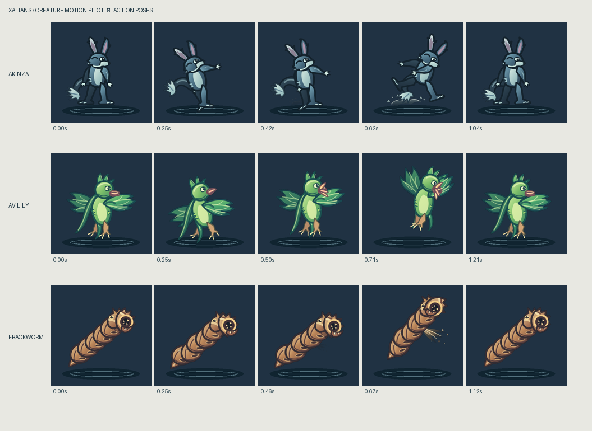
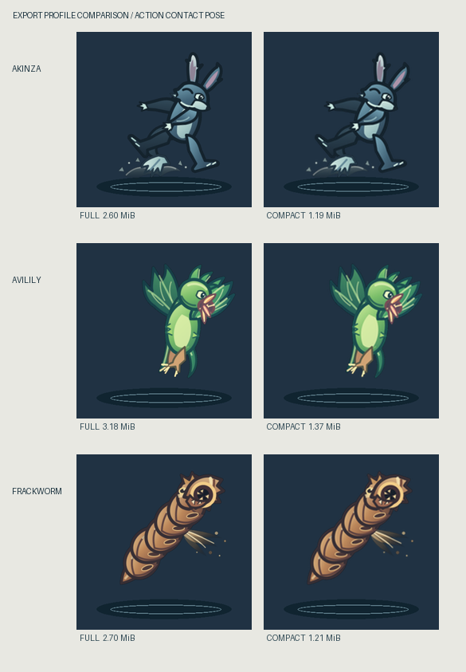

# Creature motion pilot

This is an isolated, editable art pipeline for three ratified Xalian species. The illustrated cutout style is a working animation method, not a selected permanent style. The existing portrait remains a reference. This package does not alter creature data or integrate a game.

The broader [art direction review](../../docs/design/creature-art-direction-review.md) compares the silhouette direction, illustrated and pixel treatments, drawn animation, and 3D options before any permanent style choice.





## What is here

| Path | Role |
| --- | --- |
| `source/*.svg` | Editable vector character and effect art. Each named top-level group is a moving part. |
| `tools/export_parts.py` | Renders SVG groups as aligned transparent PNG layers. |
| `godot/scenes/*.tscn` | Editable Godot cutout rigs with `AnimationPlayer` clips. |
| `godot/build_scenes.gd` | Initial scene and keyframe construction. Run with `-RebuildScenes` only when replacing the scenes. |
| `godot/catalog.json` | Species, clips, frame rates, visual timing markers, and export profiles. |
| `godot/render_frames.gd` | Renders the actual Godot animation poses to transparent PNG frames. |
| `tools/package_frames.py` | Packs sprite sheets and frame metadata, then makes review previews. |
| `exports/*/manifest.json` | Engine neutral contract for full-resolution clips. `exports/*/compact/` holds the smaller profile. |
| `preview/*.gif` | Playback of all nine clips on a sample battle background. |
| `runtime/atlas-player.mjs` | Small canvas reader for either export profile. |
| `runtime/index.html` | Standalone playback workbench with creature, clip, speed, timeline, mirror, and profile controls. |
| `demo/index.html` | Standalone battle scene to judge action and hit timing at play size, with a review scorecard. |

The SVGs and Godot scenes are source assets. Part PNGs and exported frames are build products. The generated scene files are editable in the Godot GUI. A normal build preserves scene edits; `-RebuildScenes` replaces all three scenes from `build_scenes.gd`.

## Rebuild on Windows

Install Python 3, then run `python -m pip install -r tools/requirements.txt`. Download the standard, free [Godot 4.7.2 Windows build](https://godotengine.org/download/windows/) and extract it. The GUI executable is needed for the rendering pass because Godot disables rendering in headless mode.

```powershell
./build.ps1 -GodotPath 'C:\path\to\Godot_v4.7.2-stable_win64.exe'
```

This imports parts, preserves existing rigs, renders nine clips, checks frame bounds and distinct poses, packs two export sizes, and updates previews. Use `-RebuildScenes` only if you want the script's default joint hierarchy and keyframes again. Inkscape can edit the SVGs, while Godot can edit the generated scenes and keyframes. Both are free and open source. The build itself uses CairoSVG and Pillow.

The renderer needs a graphics context. The build uses Godot's documented [`--import` command](https://docs.godotengine.org/en/stable/tutorials/editor/command_line_tutorial.html), waits for asset import and scene generation, then launches the Godot GUI executable in a hidden window for frame capture. It checks imported texture hashes against their source PNGs. The render writes fresh `render-info.json` metadata for each clip; packaging rejects missing or stale renders. `render.log` records Godot errors.

To see the art in a game-like moment, run the local demo server from this directory:

```powershell
./start-demo.ps1
```

Then open `http://127.0.0.1:8765/demo/`. Select an attacker, a defender, and the full or compact export. The scene loops an action, uses the action clip's named timing marker to begin the defender's hit clip, updates a sample vitality bar, and returns both creatures to idle. Replay, pause, speed, and scrub controls expose the timing. `http://127.0.0.1:8765/runtime/` opens the more detailed clip workbench. Both pages are standalone and do not connect to an existing game. The server can be stopped with the process ID printed by `start-demo.ps1`.

## How to judge this pilot

Use the battle demo at roughly 390 px browser width and 1× speed. For each attacker, watch once without scrubbing, then check the cue in slow motion. Compare Full and Compact at the same displayed size. The review panel records four observations: immediate creature recognition, a readable build to the action, reaction timing, and Compact clarity. Its notes are stored in your browser and can be downloaded as text.

The practical pass condition for another art iteration is that these four questions receive a clear yes across all three attackers at phone size, without cropped poses or visible part gaps. A "Needs work" answer is useful evidence: name the species, clip, and beat in the notes so the editable rig can be changed. This is a visual acceptance target for the pilot, not a platform or game rule. The sample vitality bar is presentation only; a real game's combat logic would decide the outcome and use the art marker only to align presentation with that result.

## Using an export

Each species has a `manifest.json` and three transparent PNG sheets per export profile. Read a clip's `sheet`, `fps`, `loop`, and ordered `frames`; draw the frame rectangle into a fixed destination cell. Keep that destination cell fixed so the animation does not jump as the silhouette changes. `origin` is a suggested floor placement anchor. The optional `markers` name visual timing points such as `contact_pose`; they do not declare combat results. A game triggers a clip and owns all gameplay outcomes. The art package contains no reward or creature genesis data.

The full profile uses 384 by 384 cells. The compact profile uses 192 by 192 cells with matching clip timing and scaled origins. The three sheets total roughly 2.6 MiB full or 1.2 MiB compact for Akinza, 3.2 MiB full or 1.4 MiB compact for Avilily, and 2.7 MiB full or 1.2 MiB compact for Frackworm. The smaller profile remains readable at the sample phone scale. The workbench can switch between both at the same display size.

The separate frame PNGs under `exports/<species>/<clip>/` are intermediate output and ignored by Git. A runtime needs only the three sheets and one manifest for its chosen profile. `runtime/atlas-player.mjs` has a `loadAtlas()` helper and `drawFrame()` function. A game can use that reader or implement the same small manifest contract in its own renderer.

## Adding another creature

1. Add `source/<key>.svg` with separate named top-level groups on the 300 by 300 source canvas. An optional `source/<key>.effects.svg` holds effect groups without showing them in the resting character artwork.
2. Create `godot/scenes/<key>.tscn` in Godot with a pivot hierarchy, aligned part textures, and `AnimationPlayer` clips. The existing scenes show biped, avian, and segmented-body setups. `build_scenes.gd` is an initial generator for those three scenes, not a universal anatomy rig.
3. Add the species and its clip frame rates, loop flags, and optional visual timing markers to `godot/catalog.json`. The exporter, renderer, packer, and workbench then discover it from the catalog.
4. Run `build.ps1`. Inspect action, hit, and idle at the intended display size and correct joins or clipping in the editable sources. The build rejects frames touching the capture edge.

## Review notes

- Akinza uses separate torso, head, ears, arms, legs, and two tail pieces. Its action anticipates, leaps with a forward arm and leg change, kicks up snow, then recovers.
- Avilily uses broad wing joints, taloned feet, crest and streamer feathers, and a beak assembled from opening petals. Its action folds the wings, opens the flower beak, rises, and recovers.
- Frackworm uses an articulated chain of overlapping plates, a head, and a lower jaw. Its action coils, sprays sand slurry from a vent, extends, and recovers.
- All nine clips contain hand-keyed part rotations and translations in Godot. The final images are rendered frames from those rigs.
- The cutout joins could still be polished at extreme poses. The workbench is a standalone reader; no game surface has been changed.
- Current 384 by 384 cells favor clear margins during motion. They are deliberately larger than the 300 by 300 source illustrations.

Godot is [MIT licensed](https://godotengine.org/license/); [Inkscape](https://inkscape.org/about/) and [Krita](https://krita.org/en/download/) are free and open source options for future art editing. This pilot requires no paid editor, subscription, or runtime license.

## Verification

Run `node --test runtime/atlas-player.test.mjs demo/sequence.test.mjs` to check all catalog species and both export profiles against the generic canvas reader, plus cue-to-reaction timing in the demo. The build checks every captured frame for nonempty art, clipping at the cell edge, and enough distinct poses. A source edit to Akinza's ears changed the first rebuilt action sheet, and the next rebuild reproduced the same sheet hash. This verified that a single build uses the freshly imported artwork.
