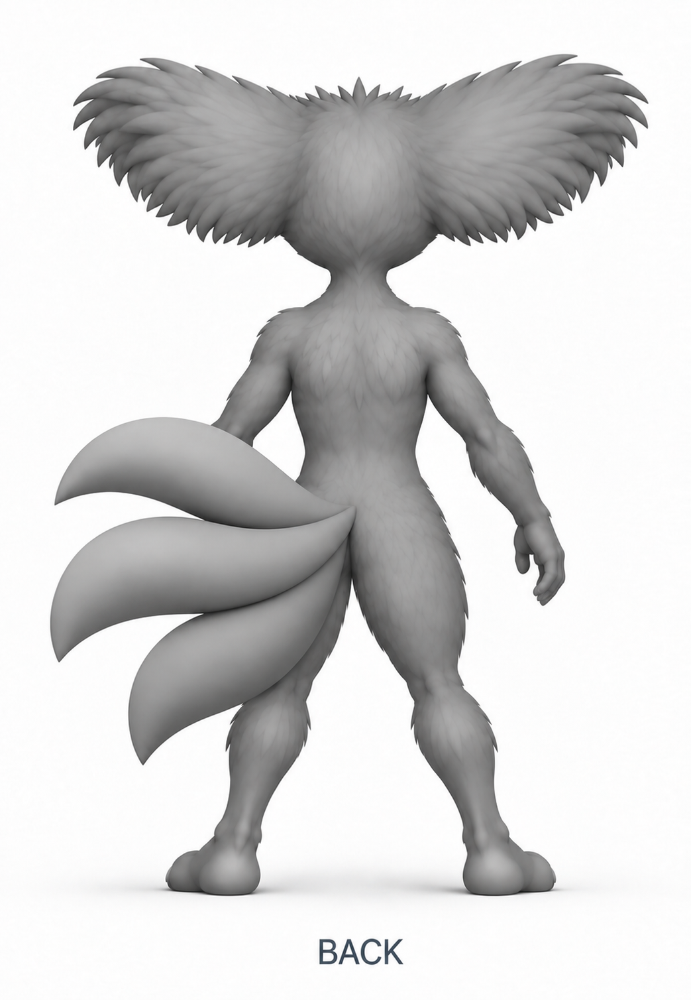
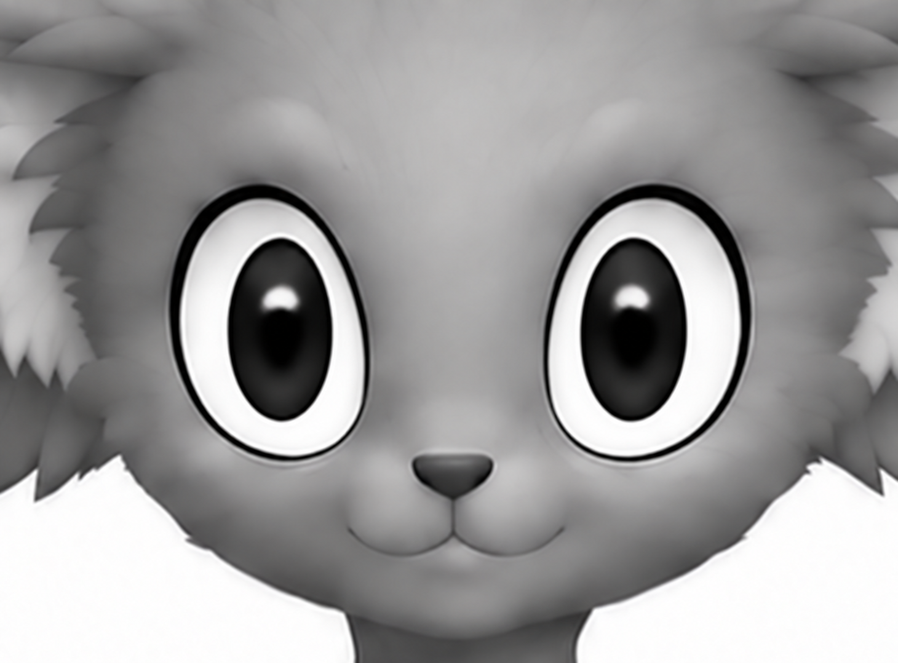
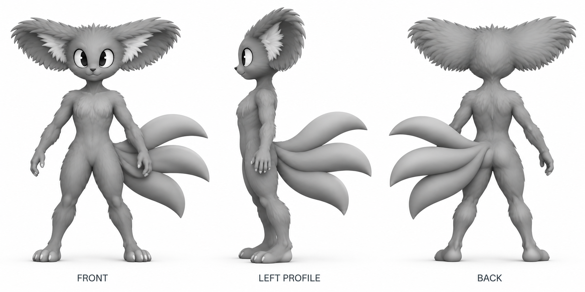
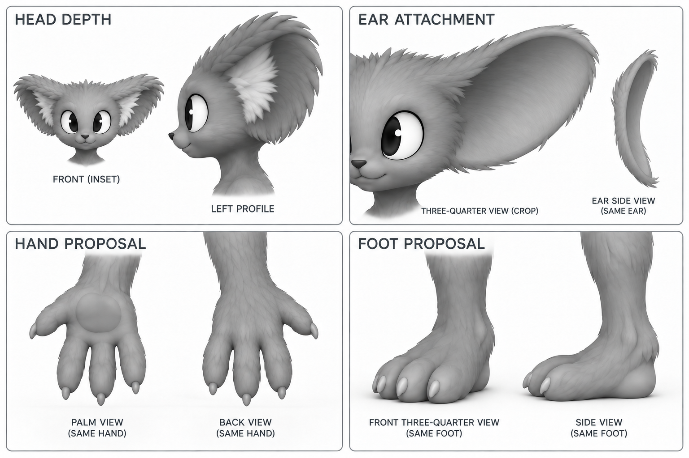

# Akinza whole-body construction review

Current state, 2026-09-28: study-0018 tail shape and positioning and study-0010 gaze are accepted. The human-like hand/foot proposals below are superseded. [Animal-paw study-0020](paw-study.md) is the current unapproved review target. The earlier sheets remain history, not a current consolidated master.

Status: Nick accepted the remaining visible design direction while requesting corrections to the tail root, rear contours and gaze. Nick accepted the gaze with "yup", then withdrew rear approval and clarified bilateral overlap at the root. This resumes layers 3 and 4. The neutral stance is an agent-selected inspection arrangement; expressive pose selection remains deferred.

## Current review state

The latest rear candidate is [study-0018 with a clean transition](tail-transition.md). Studies 0008, 0012 and 0013 do not satisfy the central shared-root requirement. The earlier assessment of study-0008 as centered was incorrect. The gaze in study-0010 is accepted. See [the exact feedback sequence](correction-review.json).

## Superseded rear and accepted gaze

Study-0008 isolates the rear view. Its three tails sweep left, but their junction remains incorrectly left-sided. The lower-back surface is flatter and lacks the previous paired cheek highlights. Nick rejected this attachment after reconsideration: the root remains left-sided and does not overlap both sides of the rear body. Do not use it as an accepted rear reference.

Study-0010 isolates the gaze. The pupils now have white space on both sides while retaining the large oval eye design. Use this detail instead of the inward-looking pupils in every earlier whole-body and head sheet. Nick accepted this gaze. It still needs integration into a coherent construction master without regression.

Whole-sheet attempts 0006 and 0007 did not reliably preserve both the centered root and correct tail direction. Study-0009 retained the inward gaze. They are saved as superseded attempts, not alternative designs for Nick to select.

## Whole-body volumes

Study-0003 makes the short muzzle, rounded cranium, narrow neck, torso depth, limb transitions and planted feet visible together. Nick said everything else looked good while identifying root placement, rear contours and crossed gaze. Carry the remaining proportions forward without reopening them. Fur still obscures some underlying forms.

Do not use this sheet as three projections of one proven object. Its profile repeats a broad tail fan instead of foreshortening the sideways sweep. Its hand and toe counts also differ from the explicit detail proposal below. The accepted probe-0003 tail shape remains authoritative, including full round volume, pointed taper and direct fusion at the body. The new illustration cannot supersede that acceptance.

## Connections and small forms

Study-0005 refines study-0004. The ear panel now exposes a continuous shallow cup with a soft rim beneath the hair, and the two hand views have opposing thumb placement. The head inset retains the furry appearance for identity, but its front gaze is superseded by study-0010. The smooth ear panel is a construction simplification, not a proposal to remove the finished fur.

| Part | Proposed interpretation | Review boundary |
|---|---|---|
| Head and muzzle | Rounded skull, large oval eyes, tiny nose, short projecting feline muzzle | Judge depth and character; camera labels are nominal |
| Ears | Broad high attachment, shallow cupped surface, soft rim, shaggy hair at the boundary | The narrow inset illustrates thickness; it is not a measured section or actual orthographic render |
| Torso and limbs | Slender central body, rounded shoulder/limb transitions, lowered arms with hand clearance | Remaining design direction accepted subject to the three named corrections; no new muscle or skeleton specification |
| Hands | Three long fingers plus one shorter opposed thumb, four small claws, compact palm | Explicit art proposal; exact count and palm-pad shape are not established species facts |
| Feet | Three forward toes, small claws, broad planted sole and modest heel | Explicit art proposal; reconcile whole-body toes to the chosen detail before modeling |
| Tail | Existing accepted probe-0003 shape | No renewed tail-shape or expressive-pose decision requested |

## Evidence precedence and unfinished work

Use Nick's existing corrections and scoped tail acceptance first. Use study-0018 as the current unapproved rear candidate and study-0010 for the accepted gaze. For new hand/foot construction and the ear shell, use study-0005 rather than contradictory study-0003 details. Study-0003 remains a whole-body proportion study. Study-0004 is retained as revision history: its ear remained feather-like and its supposedly opposite hand views had the thumb on the same page side.

Only the clean tail transition and central placement in study-0018 are the current subjective review target; do not ask for gaze approval again. These studies are not eligible for final pack approval. After review, integrate the corrected gaze and rear with the retained body direction and reconcile the chosen digit forms into coherent construction references. Preserve the accepted actual tail geometry. A small geometric probe may resolve projection ambiguity. Build the complete rough creature only after coherent construction references receive Nick's approval. Then compare actual camera renders and an unseen-angle turntable before surface detail or rigging.

No masks, camera matrices, depth maps or alignment pass are claimed for these image studies. Those outputs belong to actual geometry or the later registered pack. No species contract, abilities, lore or approved asset directory changed.

Exact prompts and provenance: [whole-body study](records/study-0003.json), [initial detail study](records/study-0004.json), [corrected detail study](records/study-0005.json), [first body correction](records/study-0006.json), [second body correction](records/study-0007.json), [rear correction](records/study-0008.json), [unsuccessful full-front gaze edit](records/study-0009.json), and [isolated gaze correction](records/study-0010.json). All images were generated using the built-in Codex subscription tool. Model and seed were not exposed. Full originals and input snapshots remain in the local ignored work directory; the displayed review images are exact committed copies of the outputs. See [scoped directional acceptance](body-direction-acceptance.json) for Nick's exact words and excluded aspects.

Latest refinement: Nick asked to combine the earlier proportions with the centered base, moderating the large blend and long lower tail. Study-0015 is the current rear candidate; study-0014 is an intermediate placement correction. Accepted gaze and other retained design aspects remain unchanged.

Current rear revision: Nick rejected the separate furry lobe in study-0015. [Study-0018](tail-transition.md) removes that added mass and refines central placement. Studies 0016/0017 are placement intermediates. Study-0018 awaits review; accepted gaze remains unchanged.

Current status, 2026-09-28: Nick accepted study-0018 tail shape and positioning, while rejecting the human-like hands and feet. The accepted gaze remains unchanged. The next review is [animal-paw study-0020](paw-study.md). This supersedes earlier pending rear-review wording; complete construction remains unreleased.
