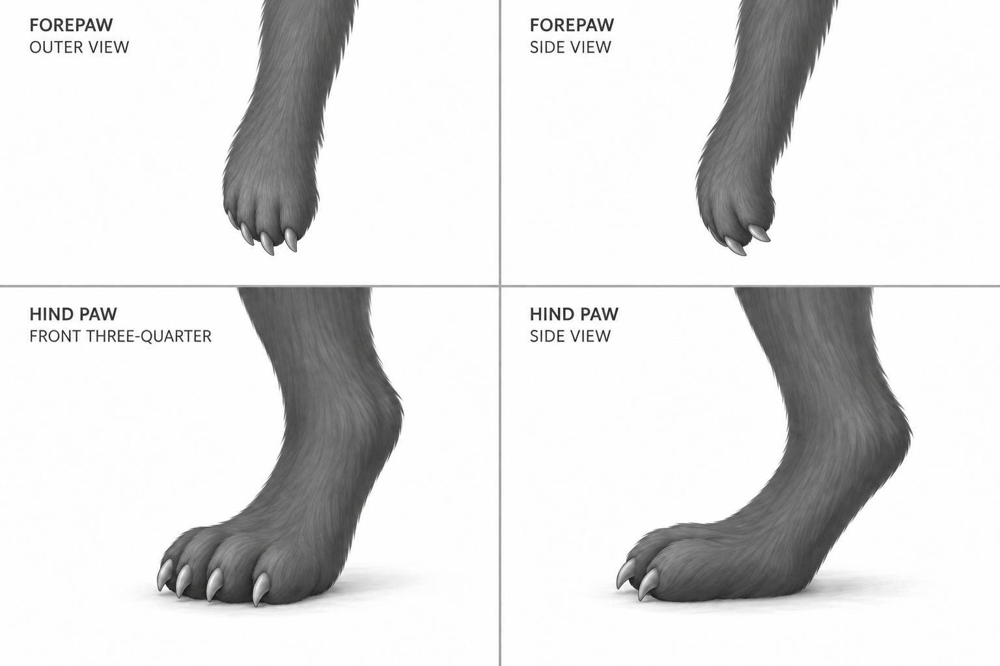

# Akinza animal-paw direction

Accepted direction, 2026-09-28: Nick said "looks good, proceed" in response to study-0020. See [paw-acceptance.json](paw-acceptance.json) for his full words and exact evidence. Tail study-0018 and gaze study-0010 remain accepted in their scopes. Full-body integration is still provisional.

Nick said:

> this tail and positioning looks good. You're starting to give the creature human-like hands and feet, and that is not going the direction that I originally wanted, but otherwise, the tail looks good

## Scope and source

Use the original abstract silhouette's small clawed extremities and slender limbs as guidance. The preferred first-round sheet supplies soft fur style and relative paw scale only. Its obsolete gaze and tail are not new design inputs. The existing species record describes an upright feline biped and clawed hands; it does not establish an opposed human thumb, exposed human palm, exact digit count, or human foot construction.

This correction supersedes study-0005's proposed long fingers, opposed thumb and broad human-like foot treatment. Its ear-shell study remains useful. Stable annotation IDs such as `hand-left` do not imply human anatomy and need not be renamed. No species facts, abilities or lore changed.

## Accepted paw direction and remaining integration

- Forepaws: compact furry ends to slender arms, short clustered digits, small curved claws and a relaxed hanging posture. No long separated fingers, prominent opposed thumb or exposed human palm.
- Hind paws: compact furry toe masses and pointed claws with a shorter animal-like foot profile. The ankle transition shown here is a visual proposal. It must be reconciled with the existing full-body leg posture; this sheet does not establish a new gait or skeleton.
- Four visible clawed digits in the broad views are a proposed visual arrangement, not a ratified species count. Side views hide some digits through overlap. Review scale and paw character in the later whole-body integration before treating these as final geometry constraints.

Study-0019 established the animal-paw direction but placed the forepaws on the ground. Study-0020 corrects the upper pair to hang from the arms, consistent with the upright biped. The lower pair remains the hind-paw direction. The labels name intended views; these are not calibrated observations of a single mesh.

The accepted tail and gaze were not regenerated in either study. Carry [tail-rear-acceptance.json](tail-rear-acceptance.json) and the existing gaze acceptance into the next consolidated construction reference. Do not ask Nick to approve either again unless subsequent work materially changes them.

Exact subscription prompts, original outputs and immutable input hashes: [study-0019](records/study-0019.json), [study-0020](records/study-0020.json). The displayed review image is an exact copy of study-0020. Complete construction and the final pack remain unreleased.
