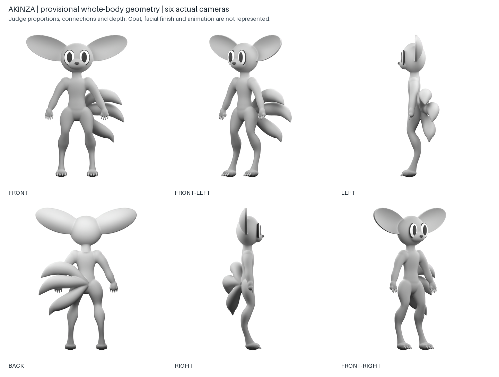
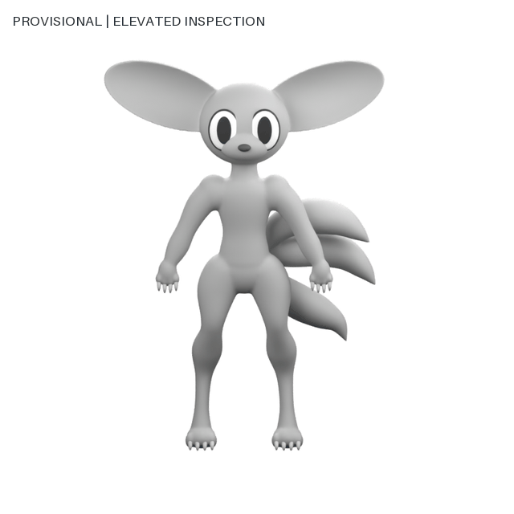
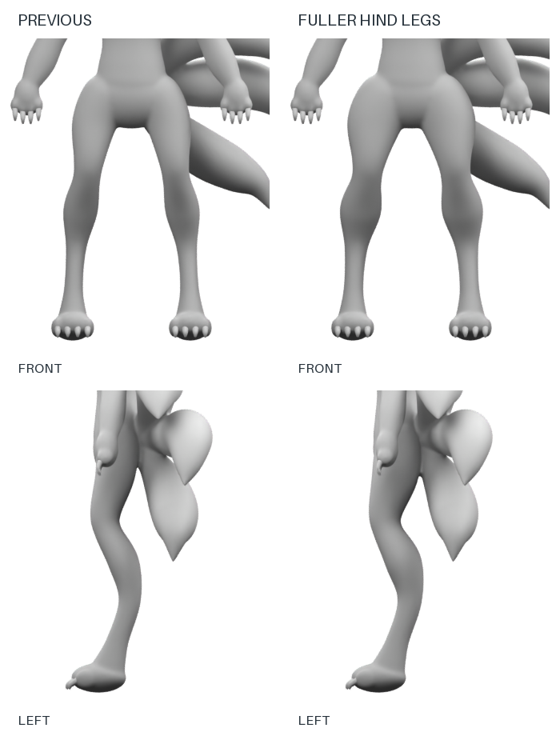

# Akinza: whole-body geometry and stronger hind legs

Date: 2026-09-28. Active work is layer 5, provisional geometric reconciliation, feeding corrections back into layers 3 and 4. This is the first complete rough creature in this workflow. Earlier layer-5 evidence covered only the tail. Nick described blockout-0004 as very close but requested modestly stronger-looking legs. The current candidate is blockout-0005; it is not yet approved.

## Review artifact

Judge whole-body proportions, volume, paw scale and limb transition, tail attachment and occlusion around the body. Fine hair, surface finish, final facial expression and animation are not represented. The smooth ears show tissue beneath the accepted shaggy rim; they are not a proposal to remove that hair. Original accepted images remain unchanged.

The six principal images use the same model, pose, orthographic scale and camera height. The elevated turntable uses a wider fixed scale to avoid clipping the large ears. These images therefore expose real projection differences that the generated sheets could disguise.

## Latest correction: implied bounding strength

Nick requested beefier hind legs as a visual cue for bounding strength, with an explicit limit: do not substitute literal rabbit legs. Exact words and reviewed evidence are in [hind-leg-feedback.json](hind-leg-feedback.json).

Blockout-0005 adds modest volume through the thighs and upper calves, tapering toward the existing joints and ankles. At the fullest edited controls, thigh width/depth radii increase 22%/17% and calf radii 20%/17%. These are construction parameters, not measurements of strength or species facts. Limb lengths, joint paths, stance, paw geometry, pelvis, tails and other parts retain their source parameters. Remeshing may alter neighboring pixels slightly.

The same front and side cameras and identical crop rectangles show the change at equal scale. The preserved parameter comparison verifies the edit scope. The whole-body result remains at layer 5, feeding a leg-volume correction back into layer 3.

## Agent review and discrepancies

| Check | Finding | Disposition |
|---|---|---|
| Three tails and central shared fusion | All three sweeps start at X=0 at the spinal base, separate immediately and join the body without an extra root bulb | Technical interpretation implemented; compare the newly modeled junction with accepted study-0018 |
| Tail side projection | The leftward fan is strongly foreshortened from a true side camera; the old generated profile showed a long fan | Retain actual projections. Old profile cannot be treated as calibrated geometry. Exact rearward reach remains a whole-body design question |
| Rear contours | One modest pelvis volume; no modeled paired cheeks or cleft | No obvious return to the exaggerated rear treatment in principal views |
| Hind-leg volume | Fuller thighs and calves with the original limb path and tapered ankles | Revised strength impression awaits Nick review; no literal rabbit leg proportions |
| Animal extremities | Short clustered digits, four claws on each proposed paw, lowered forepaws and compact hind paws | Human fingers/thumbs removed; whole-body paw size and ankle transition remain provisional |
| Eyes | Large oval surfaces with centered pupil coordinates and symmetric forward gaze | Coarse facial depth and surface blending still fall short of the accepted illustration; not final facial likeness |
| Ears and coat | Smooth continuous cupped ear tissue, simplified body | Shaggy silhouette mass and fur remain absent. Smooth blockout is not an identity or surface replacement |
| Body continuity | One closed connected body including ears, limbs, paws and tails | Passes geometry check; ocular surfaces and claws are intentionally separate detail objects |
| Production fitness | No rig, deformation checks, retopology, front-feature mask cutouts or consumer adapter | Not eligible for production handoff or final pack approval |

The current candidate is suitable for directional feedback on whole-body integration, not a passing final likeness review. Component approval does not transfer to its modeled equivalent. Full release gates remain blocked.

## Iterations performed before this checkpoint

1. Blockout-0001 exposed hard sweep caps and a disconnected eight-vertex remeshing fragment. It was not presented as successful geometry.
2. Blockout-0002 rounded shoulder and pelvis transitions. Connectivity diagnostics localized the remaining fragment to less than one voxel near a tail intersection.
3. Blockout-0003 bounded and recorded removal of isolated sub-voxel debris, reduced eye protrusion and buried thigh starts. It passed body topology checks but the elevated side camera clipped an ear. Overlapping torso volumes also produced visible bands.
4. Blockout-0004 replaced those torso volumes with one continuous sweep, increased smoothing and widened only the elevated-camera framing. Its six principal views retain their shared scale. Render integrity, unclipped occupancy and principal figure-height/ground-row diagnostics pass.

5. Blockout-0005 applies Nick's focused leg-volume correction. All 14 views are unclipped; the body has one connected component and zero nonmanifold edges, with unchanged principal height and ground registration.

Exact parameter specifications are `blockout-spec-0001.json` through `blockout-spec-0005.json`. Versioned local scenes and originals are in `untracked/species-construction/akinza/blockout-NNNN/`. [The current run record](records/blockout-0005.json) binds source decisions, spec, builders, outputs, cameras and checks. This parameterized local Blender experiment uses no paid image API.

## Next unfinished action

Get Nick's review of the modest hind-leg volume increase in blockout-0005. The remainder of the whole-body integration remains provisional. Preserve the accepted tail/paw/eye source evidence. Reconcile resulting geometry corrections before requesting rough-form approval. Facial blending and silhouette-defining fur mass remain known work before identity acceptance; detailed coat, final topology and rigging are later work. A technically sound blockout is not the finished layer-5 deliverable.
