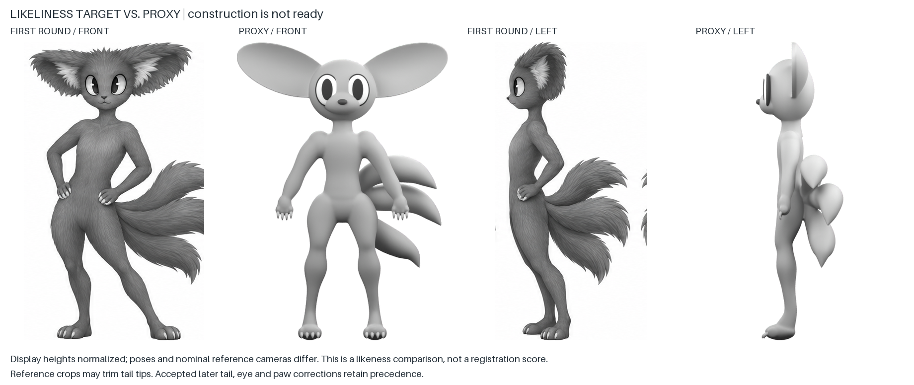

# Akinza: likeness recovery, construction incomplete

Updated 2026-09-28. Nick rejected the implication that the whole-body proxy was close to surface finishing. His standard is a 3D equivalent of the first grayscale references, without surface texture, carrying later accepted corrections. Exact words: [likeness-feedback.json](likeness-feedback.json).

## Current assessment

**There is no new model ready for art approval.** The completed experiments establish some connectivity and camera conventions, but the current geometry fails whole-creature likeness. Layers 3 and 4 need substantial shape and connection work inside the ongoing layer-5 experiment. Layer 6 has not started. This supersedes earlier descriptions of a directional full-body checkpoint as sufficient preparation for surface work.

The display normalizes figure heights to make the shape difference visible. The source's nominal views and expressive pose differ from the actual proxy cameras and inspection pose. This is an appearance audit, not a pixel-registration test. Crops can trim tail tips; the separately accepted tail reference governs that region.

## Required geometry work

| Region | Current failure | Required result before advancing |
|---|---|---|
| Head and face | Generic rounded cranium, eyes reading as attached pieces, simplified muzzle and missing cheek structure | Reference-specific forehead, cheek, muzzle and eye-socket volumes that carry the same expression without texture |
| Ears | Oval or slab-like shell; connection and surrounding coat masses fail the reference | Continuous cupped tissue within the correct large ear silhouette, integrated with the head and shaped hair masses |
| Torso and limbs | Generic smooth volumes and inadequate overall proportion comparison | Reference-guided mass distribution and credible articulation in front, profile and three-quarter views |
| Ankle and wrist | Simplified bends and bulb-like transitions to paws | Clear local joints and believable paw connections, preserving animal extremities and the straighter shin |
| Major coat masses | Essential silhouette and volume were treated as missing future fur | Model the broad ruff, crown and ear-rim forms during construction; only fine strands and microtexture can wait |
| Whole creature | Technical success was given too much weight relative to likeness | Compare the complete untextured form against the first-round target, with later approved tail/gaze/paw corrections |

## Latest experiments and why they do not pass

- **Blockout-0007:** local ankle/wrist experiment. It removes the low rear foot-pad extension, adds a modest ankle transition and replaces the forepaw ball with a tapered connection. Four actual close-up cameras expose remaining simplified pad and claw shapes. This is diagnostic evidence, not a successful whole-creature candidate.
- **Blockout-0008:** internal broader refit, rejected by the agent. Conforming eye surfaces, revised muzzle/ear contours and attempted coat masses do not deliver the target. Ear-rim forms look beaded and the face remains simplistic. Do not present it as a likeness success or ask Nick to approve it.
- Both models pass the local connected-body and registered-render checks. Those passes do not alter their failed visual assessment. Exact specs, builder snapshots and outputs are preserved in `records/blockout-0007.json` and `records/blockout-0008.json`.

The volume/sweep builder, including the new experimental features, has not demonstrated enough shape control or achieved the required sculptural quality. Repeated parameter tweaks are not a validated route to the target. Existing rendering, camera, provenance and mask tools can be reused independently of the geometry-authoring method.

## Work still required

Replace the inadequate coarse shape construction with reference-guided surface modeling capable of the head/ear/face and articulated limb forms. Validate a complete region against front and profile references before extending that method across the body. Do not return to Nick with another known mismatch or imply that adding texture will supply missing structure. The geometry-authoring method and faithful model remain unresolved; this record is an audit and failed experiment, not completion of the modeling task.

The first-round sheet is the likeness target. Later accepted central tail fusion, reduced rear contours, forward gaze and animal paws retain precedence. The source sheet's historical rejected-pack status reflects its view/pose inconsistencies, not rejection of the appearance Nick prefers. No full-stage approval, species-canon change, paid image generation, final topology, rigging or animation is claimed.
