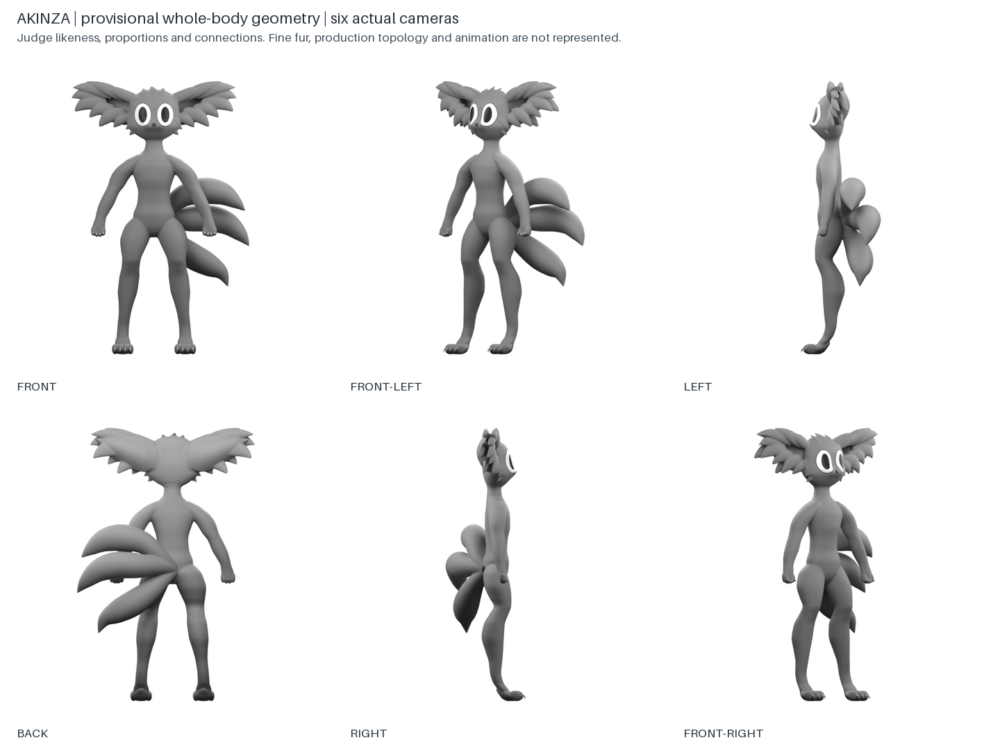

# Akinza clay construction candidate 0020

Updated 2026-09-28. Candidate 0020 is ready for Nick's whole-creature clay review. It is not approved art or a completed-stage release. The preferred first grayscale sheet remains the likeness target, with later scoped tail, gaze and paw corrections. Earlier rejected proxies and their snapshots remain in history.

## What changed

The reconstruction replaces the round head and stacked limb primitives with authored continuous section surfaces. The face has integrated oval eye surfaces, a shallow connected muzzle, a small triangular nose and a surface-following mouth crease. The shoulders, wrists, knees, shins, ankles and compact paws were rebuilt as connected volumes. Foreclaws are short curved pointed forms; hind toes emerge from a sloping paw roof.

The ear work required another change of representation. Beads, scalloped envelopes and global folds failed to read as coat. Focused subscription-generated study-0021 clarified a smooth cupped tissue shell surrounded by overlapping broad tapered coat masses. Candidate 0020 models those masses directly, varies their lengths, sweeps the crown back, and blends the rear ear roots locally into the cranium. The generated study's inward pupils and excessive small locks were excluded.

The fuller hind legs, straighter shin, central body-level three-tail fusion and restrained rear remain. The lowered-arm inspection pose is separate from the expressive identity reference. Actual tail foreshortening is retained rather than rotating tails to present the same fan to every camera.

## Independent visual review

Reviewer `/root/likeness_review` inspected the principal and elevated views and iterated on major revisions. Final verdict: **pass for presentation as a clay construction review candidate**. The reviewer found no remaining concrete major visible construction defect that warranted withholding the candidate. Exact scope, words and artifact bindings are in [independent-review-0020.json](independent-review-0020.json).

This is readiness for Nick's judgment, not a claim that likeness is settled or that only texture remains. Broad coat grouping is an interpretation. Nick can still reject the head, body, attachments, proportions or overall appearance. Fine fur, material treatment, production topology, deformation and rigging are not certified by this review. The dark profile pocket was checked against alpha and geometry depth: it is shaded near-ear geometry, not a through-hole.

## Technical evidence

- One connected closed body: 353,138 vertices and zero nonmanifold edges. Eyes, nose, mouth and claws are separate detail surfaces by design.
- Six principal orthographic views and eight elevated inspection views, all from one scene. Occupancy is unclipped and principal height and ground rows agree.
- Exact-model depth, camera-space geometric normals and object identity arrays for all six principal views. Ray/alpha occupancy agreement is at least 99.88%; the small difference is pixel-center sampling versus antialiasing.
- A GLB round trip preserves all 842,748 triangles and world bounds. This is a dense construction reference, not animation-ready topology.
- The portable handoff binds images, masks, cameras, landmarks, geometry, references and exact authoring inputs. Approval fields remain empty. See [surface-handoff.md](surface-handoff.md).

## Layers at this checkpoint

| Layer | Reviewable evidence | Approval state |
|---|---|---|
| 1. Interpretation | Reading, reference map, scoped directions and exclusions | Earlier scoped directions retained; complete package approval pending |
| 2. Identity | Preferred first-round sheet and retained eye/tail/paw references | Whole-creature likeness remains Nick's judgment |
| 3. Construction | New full clay views and authored model surfaces | Candidate ready for review |
| 4. Connections/detail | Actual face, ear, wrist and ankle closeups; integrated attachments | Candidate ready for review |
| 5. Geometric reconciliation | One connected model, six views, elevated turntable and technical checks | Internal readiness passed; Nick approval pending |
| 6. Surface/handoff | Surface direction, portable geometry-reference bundle, masks and calibrated data | Provisional handoff assembled; release blocked |

All six layers now have working evidence or handoff artifacts. None is newly declared approved. The next gate is Nick's review of candidate 0020; incorporate his corrections before promoting a final pack or beginning another species. Finished model production and animation remain downstream of this construction system.
