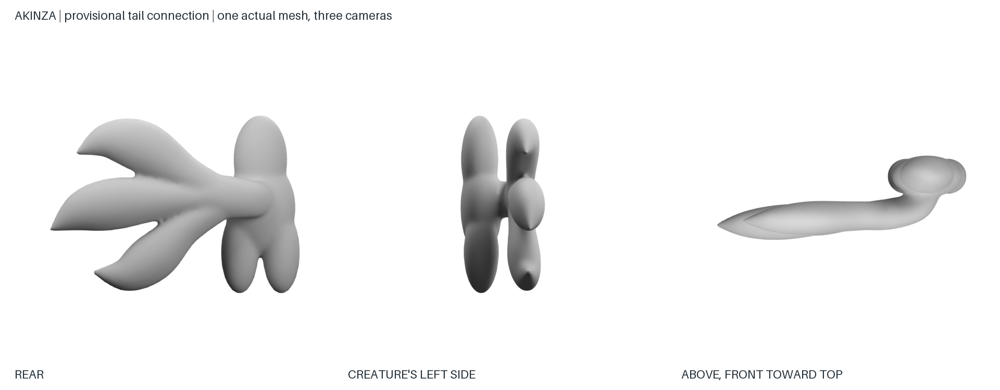
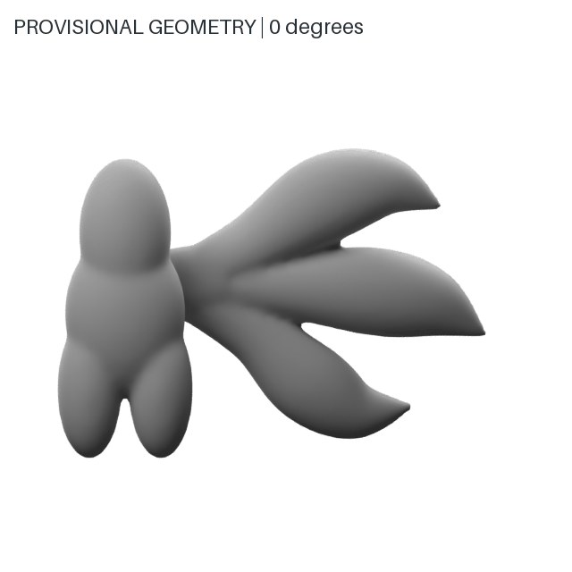
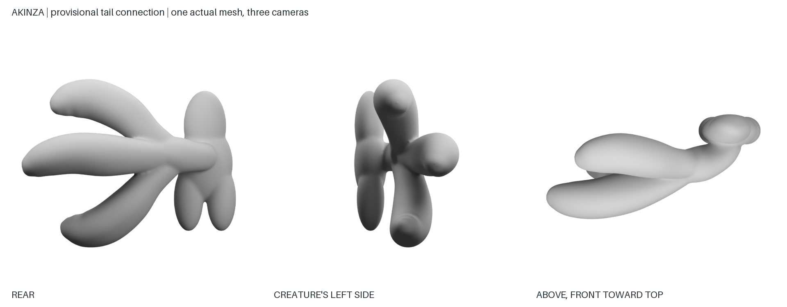
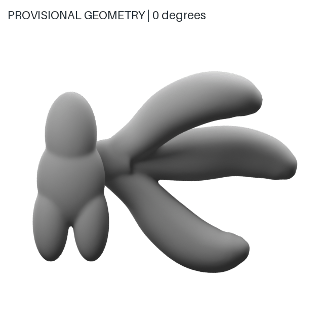
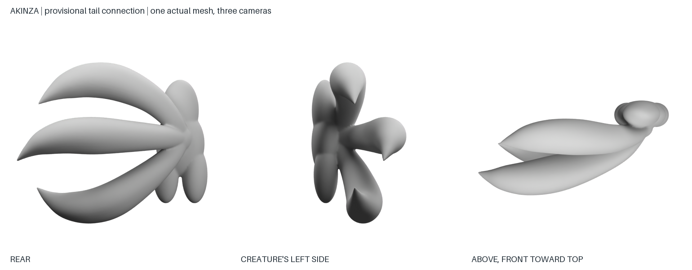
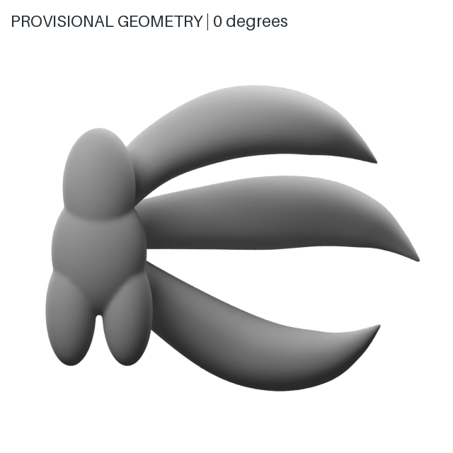
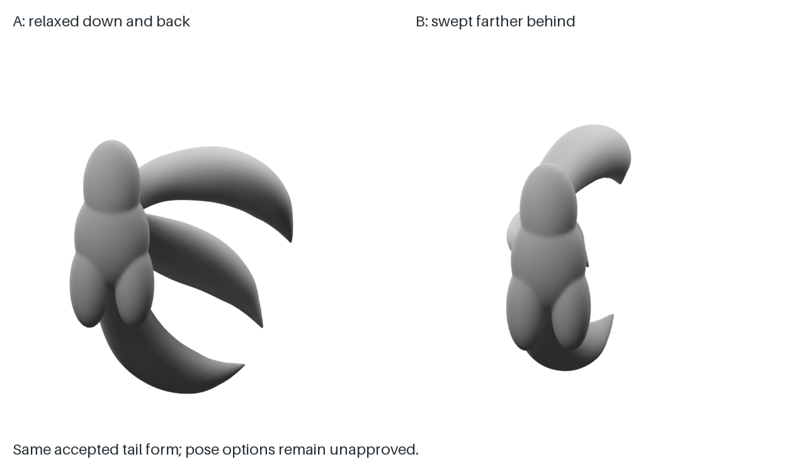

# Akinza construction exercise review

Reviewer: Codex, 2026-09-27. These are agent observations, not Nick's approval. Run paths are relative to the repository root and working files remain local under `untracked/species-construction/akinza/`.

Exact prompts, subscription tool metadata and input/output hashes: [modeling-pose study](records/study-0001.json) and [attachment study](records/study-0002.json). The geometry probe uses [the versioned volume spec](probe-spec.json) and [recorded cameras and checks](records/probe-0001-geometry.json).

## study-0001: modeling pose

`study-0001/construction.png` proposes arms lowered away from the torso while preserving the large ears, eyes and three plumes. It is useful for evaluating whether the new pose is desirable. It is not a valid multiview construction master: the left profile retains too much lateral tail spread; the back hand is obscured; substantial fur detail remains; nominal cameras and projections are not measured. Reject it as a geometry constraint set while retaining it as a pose proposal.

## study-0002: generated attachment sheet

`study-0002/tail.png` simplifies the tail into smooth volumes. The labeled left and above panels do not provide trustworthy orthographic left/top views of one object. The above panel is tilted, and the pelvic form regresses toward prominent rounded cheeks. The prompt also contained an incorrect page-side instruction for the above camera. Reject this sheet as geometric evidence. Do not carry its body shaping or camera labels into modeling.

## probe-0001: actual geometry, rejected for flatness

`probe-0001/probe.blend` contains one fused tail and pelvis mesh, built from the versioned `probe-spec.json`. `geometry.json` records one connected component, zero nonmanifold edges, 16,778 vertices, actual camera matrices and output hashes. These are connectivity checks, not artistic approval or animation-topology certification.

`probe-0001/contact.png` shows rear, left and true above views. `probe-0001/turntable.gif` shows eight elevated angles. The same shared trunk joins all three plumes. Side and top views correctly compress the lateral fan rather than duplicating the broad rear silhouette. The model's shallow fan depth is now visible and can be corrected explicitly. The pelvis and torso are schematic volumes. The finished furry shape, depth, taper and relationship to the whole creature still need review.

Portable technical previews, explicitly unapproved:

Eleven occupancy masks are derived from render alpha at threshold 128, with provenance in `review-assets.json`. No painted normal/depth maps or independently generated masks are presented as measurements. The Blender builder is a tested local geometry-probe adapter, not an adapter to the existing full-creature rig templates.

## probe-0002: fuller rounded tails

Nick's correction: "It should feel fuller what you built is too flat, It should look closer to three cattails than whatever fork-looking thing you have there".

`probe-spec-0002.json` replaces the blade-like cross sections with round sweeps, sustained thickness, rounded terminal caps and staggered front-back paths. The common spinal root and connected trunk remain. The pelvis is unchanged. All eleven views come from the same new mesh; this is local Blender geometry, not an image-generation call. Occupancy masks are derived from its render alpha.

The side and true overhead views now show full curved volumes and substantial depth. The tails remain smooth construction surfaces without final fur. Provisional dimensions, tip shape and fullness still require Nick's visual judgment. The earlier probe and its evidence remain preserved as rejected history.

## probe-0003: direct body fusion and pointed taper

Nick asked for pointier tips, then clarified: "Yes, and I also think you need to fix where the tail splits. Right now it's shaped more like a trident where there's one base and it branches later. But what I want is more like three distinct tails coming to one base where they're all fusing together at the base and body together". He authorized continuation with "proceed with adjustments".

The [new spec](probe-spec-0003.json) removes the trunk sweep entirely. All three tail sweeps start at the spinal attachment and fuse into a compact base touching the body. Their paths diverge immediately, retaining round cross sections and depth. Each tail narrows over a longer terminal section into a pointed end. The pelvis is unchanged. This supersedes probe-0002's delayed split and rounded caps, while preserving its fuller volume direction.

The mesh has one connected component, zero nonmanifold edges and 72,122 vertices. Eleven actual camera views and alpha-derived masks are retained. These are technical geometry checks, not Nick's approval. Full-body proportion, fur and final topology remain outside this local study.

## Shape accepted; pose studies 0004 and 0005

Nick said: "Yeah, that's much better. I don't really have much to say to adjust it. The pose that it's in isn't necessarily my favorite, but the shape of the tail I think looks all right".

The [scoped acceptance](tail-shape-acceptance.json) binds the accepted form to probe-0003's spec, mesh and shown evidence. It covers tail volume, taper and direct body fusion. It explicitly excludes pose, full-creature geometry and the final pack.

Option A (probe-0004) tilts the complete tail assembly 25 degrees down and 30 degrees toward the back. Option B (probe-0005) tilts it 8 degrees down and 65 degrees toward the back. Both use the exact accepted control curves and circular cross-section radii under a rigid transform, preserving all pairwise control-point distances to floating-point precision. No tail is lengthened, thinned or given a new curve. The compact body connection is remeshed, so the final fused surface is not an identical mesh.

Each option has eleven actual camera views, derived masks and a turntable. The comparison uses the same camera directions and orthographic scale for both. Body fragments remain schematic; these are tail-orientation choices rather than complete creature poses.

## Approval state and next action

Nick's earlier direction on root, restrained pelvis, eye interpretation, hair and style is retained. Probe-0003's tail shape is now accepted in the scoped record. Neither new pose, the full modeling pose, construction master nor final pack is approved. Complete stage approval fields remain null because acceptance of one aspect does not release an entire stage.

The next review concerns pose only: option A, option B, or a different direction. Preserve accepted tail form while applying the chosen pose to the construction references. Earlier flat, blunt-tip and delayed-split references remain superseded and stale. A complete rough creature follows coherent construction evidence; a local tail acceptance does not waive that requirement.
