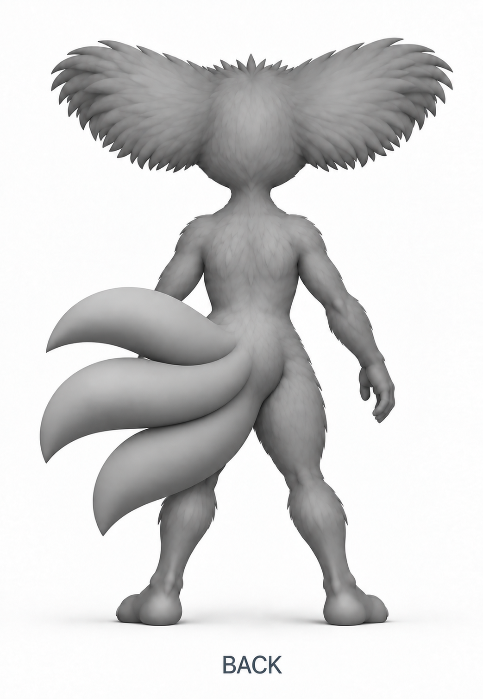
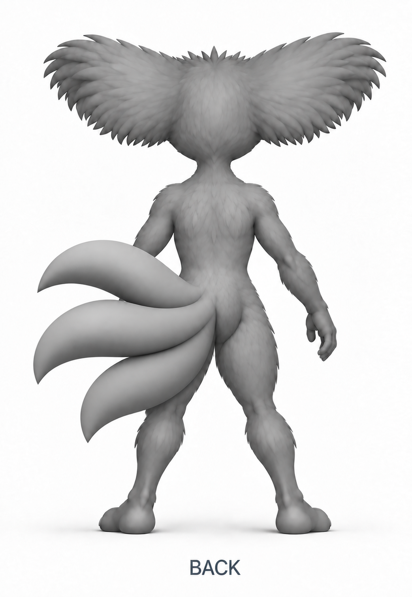

# Akinza tail-root correction

Research and review, 2026-09-27. Nick requested real animal references after repeated illustrations placed the tail junction over only the creature's left rear side. These sources inform placement, not fictional three-tail anatomy.

## Observed reference evidence

- The University of Illinois College of Veterinary Medicine's [feline pelvis example](https://vetmed.illinois.edu/imaging_anatomy/feline/hindlimb/pelvis/ex01/pel01-f%20.html) provides lateral and ventrodorsal radiographs. Visually inspected its [ventrodorsal image](https://vetmed.illinois.edu/imaging_anatomy/feline/hindlimb/pelvis/ex01/images/f0213_400x400.png) in the browser. The caudal vertebral chain continues centrally between the two sides of the pelvis.
- Visually inspected the rear-view dog photograph accompanying [Focus's article](https://www.focus.it/ambiente/animali/scodinzolio-a-destra-o-a-sinistra-per-i-cani-non-e-la-stessa-cosa). The tail base overlies the rear midline, with body visible on both sides. This is external appearance reference, not evidence for a three-tail skeleton or a required tail pose.

No external image was downloaded, edited, or included in a generation request. Sources were inspected online. Earlier search results included veterinary text describing the sacral connection, but some full pages were inaccessible; the directly inspected radiograph is the anatomical reference used here.

## Application to Akinza

Nick's required design has three full tails merging together exactly where their shared base meets the tailbone. The visible shared base must straddle the rear midline and obscure some of both sides of the rear body before the tails sweep left. This bilateral overlap is his design requirement for Akinza, not a claim that every real animal tail obscures a fixed amount of its hindquarters.

The earlier images softened a seam on the left without moving the actual attachment volume across the center. Do not call that correction successful. Judge the whole root footprint against the body midline, not the location of one pointed crease. All three basal volumes must converge at the same body-level attachment. No vertical cascade of separate joins and no long common stalk.

Study-0011's consolidation prompt was prepared but never submitted after Nick withdrew rear approval. Studies 0012 and 0013 failed to remove the left-sided stacked junction. Study-0014 explicitly moves and broadens the shared root across the midline, overlapping part of the right-side body. Its shared blend is visibly fuller; the precise compactness and placement still require Nick's review. It is not a calibrated 3D measurement or a final pack.

The forward gaze in study-0010 remains accepted. The latest correction affects the rear attachment, not the accepted eye design, general body direction, or full rounded tail bodies and pointed tips. Preserve those aspects while resolving the junction.

## Moderated blend, study-0015

Nick said:

> Yeah, I think you overcompensated a tad. Maybe combine those two a little bit so that you still have the tail base being centered, but there's not one longer tail on the bottom and one short tail on top

Retain the central base placement while reducing the enlarged blend and balancing upper/lower reach. Study-0015 uses study-0014 for placement and study-0008 only for earlier proportion reference. The lower tail is shorter and the upper/lower forms are closer in visual weight. This remains a candidate, not approval. Do not restore study-0008's left-sided attachment.

