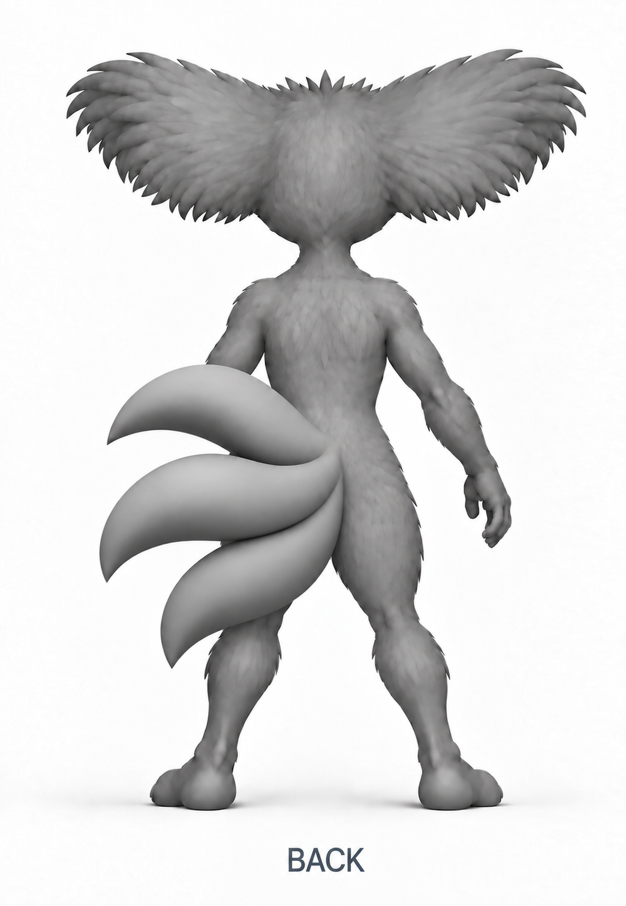

# Akinza tail transition without an added body mass

Study-0018 tail shape and positioning are accepted by Nick; see tail-rear-acceptance.json. Accepted gaze and other retained body design remain unchanged.

Nick rejected study-0015:

> That last one has like a weird growth Like it's supposed to be the butt cheek muscle, but it got squished in. I think you need to put more effort into the prompt you're giving it

## Prompt correction

The previous request to broaden the shared root allowed the generator to invent a separate furry teardrop-shaped lobe. That is not the intended anatomy. The attachment must be the blended intersection of the three existing tail bases with the lower back, with no fourth mass beside it. Bilateral overlap comes from the tails covering part of the body in this view; it does not require deforming the body into an enlarged pad.

The revised prompt explicitly locates the unwanted lobe, removes it and its outlining crease, preserves a continuous lower-back surface, and separates tail placement from body shape. All three full rounded tails still converge directly at one centered body-level attachment. The upper/lower balance, pointed tips and absence of a long shared stalk remain requirements.

## Iteration and visual review

- Study-0016 removes the separate lobe, but the junction shifts left again. Retain as an intermediate, not the current rear reference.
- Study-0017 tries moving the existing assembly instead of widening the body. The generator moves it too far right. The prompt's pixel displacement is an edit request, not a measured or verified translation.
- Study-0018 uses those two positions as limits and asks for the intermediate position. Visually, the junction is below the central back and the separate furry lobe is absent. Tail lengths and rounded taper remain recognizable. The result still requires Nick's judgment and is not calibrated geometry.

Exact prompts and immutable input/output hashes: [study-0016](records/study-0016.json), [study-0017](records/study-0017.json), [study-0018](records/study-0018.json). All three use the built-in Codex subscription image tool. No API key or paid image API was used. The displayed review image is an exact copy of the generated output.

Do not promote studies 0015, 0016 or 0017 as current. Study-0018 has its own scoped approval. After the paw correction, consolidate it with the accepted gaze and retained body/detail direction, resolving remaining view and digit inconsistencies before the complete rough creature. Do not reopen expressive pose selection.

Current status, 2026-09-28: Nick accepted study-0018 tail shape and positioning, while rejecting the human-like hands and feet. The accepted gaze remains unchanged. The next review is [animal-paw study-0020](paw-study.md). This supersedes earlier pending rear-review wording; complete construction remains unreleased.
